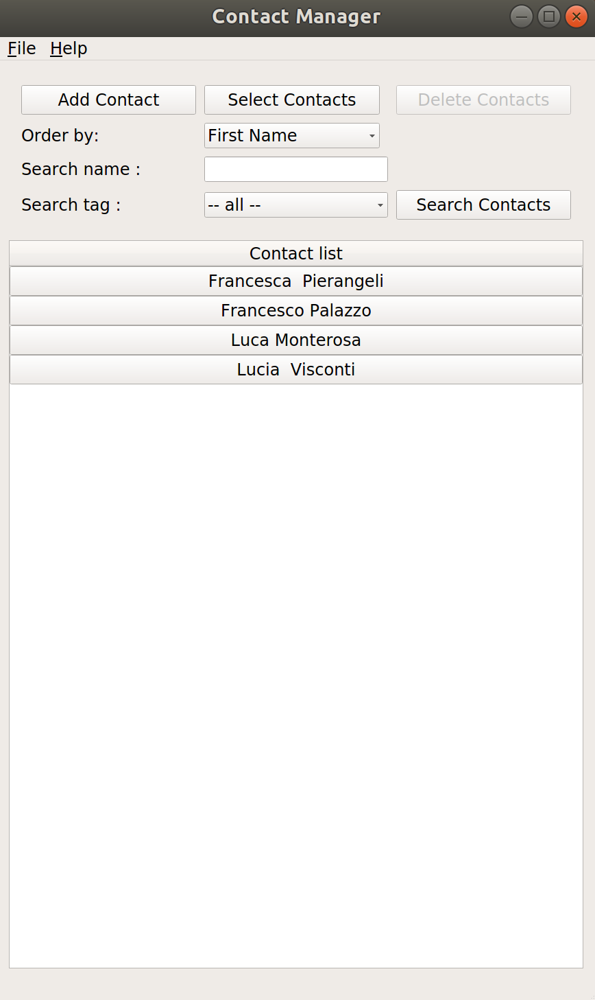
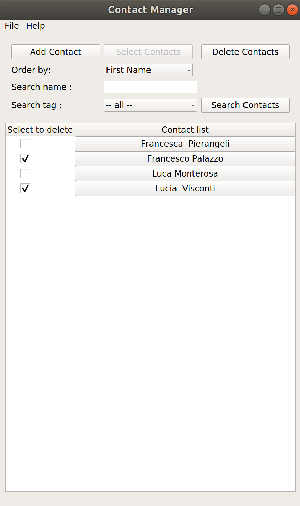
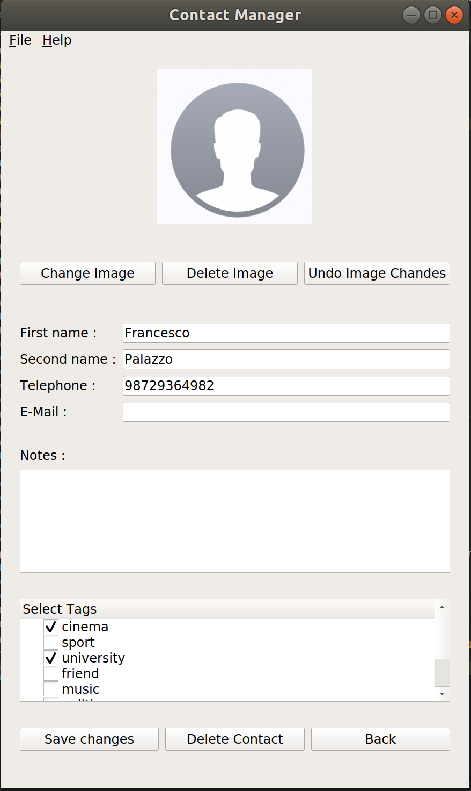
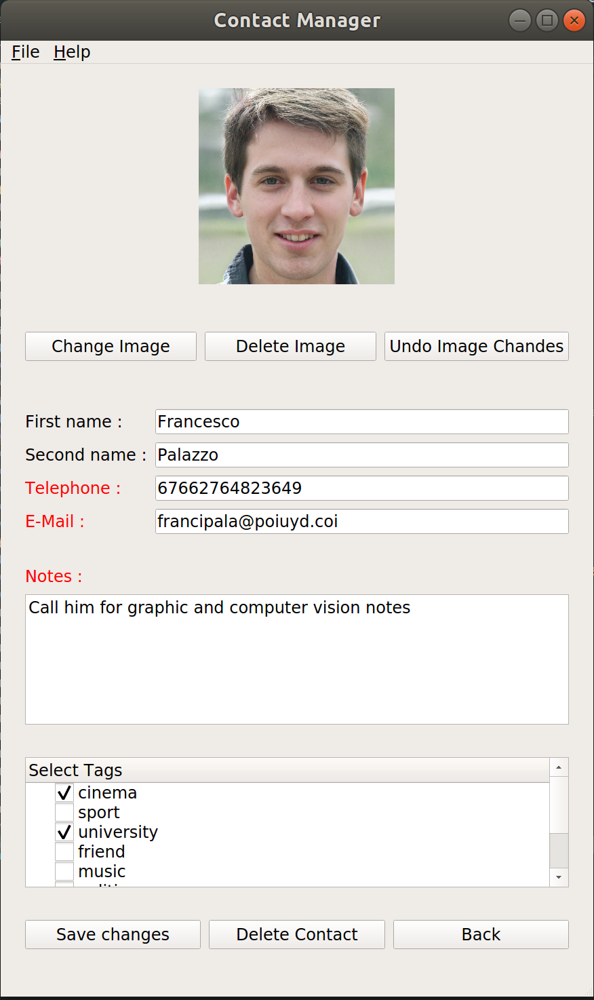

# ContactManager

This is a simple Contact Manager application used to memorize contacts informations. The application is implemented in Python and the interface is made entirely with PyQt5.

<p align="center">
  
</p>

The application is composed by a main view with which the user can manage the contact list. 

## Features

Features include:

- Multiple contacts selection : The user can select multiple contacts in order to facilitate their removal from the contact list without deleting them one by one.


<p align="center">
  
</p>


- Search contact : the user can search contact by name, surname or by other information (e.g phone number, email) and by selecting a particular tag.

- Order contact list: the user can decide which type of ordering method use: First Name ordering method or Second Name ordering method. 

- Modify contact : the user can modify existing contact by tapping in contact name. When the user modify an existing contact, the modified field changes its name color to semplify the user visualization.

<p align="center">
  
  
</p>

## Download

Get the app by downloading this repository tapping in 'clone or download' button and then select 'Download Zip' command or from [here](https://github.com/giuliobz/InverseReinforcementLearningApp/archive/master.zip).
After downloading the zip file, extract it and follow the Dependecies instructions and Usage instructions.

## Dependecies

- PyQt5

```bash
# Create the environment with pyqt installed 
conda create -n pyqt5 ipython pyqt
conda activate pyqt5
```

## Usage

Contact Manager is used by terminal support. The user has to go from terminal to the folder in which he has downloaded the github repository and then follow this command:

```bash
# Activate virtual environment in which you have installed all the dependencies
conda activate pyqt5

# Go inside the master folder 
cd ContactManager-master

# Start application
python Application.py
```